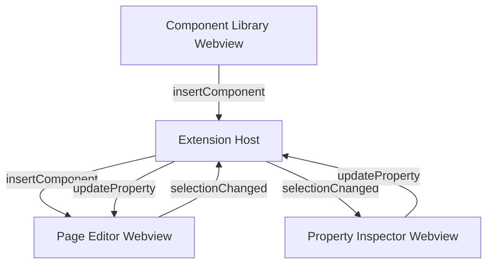

# Aggo Activity Views Design

This document outlines the design for the side panels (Activity Bar Views) that support the Aggo Page Builder.

## 1. Component Library View
**Goal**: Replicate the "Left Panel" of the reference builder.
**Location**: Aggo Activity Bar Container -> "Components" View.
**Provider**: `AggoComponentLibraryProvider` (refactor of `AggoActivityViewProvider`).

### UI Layout
- A grid or list of available components (e.g., Container, Text, Button, Image, Form).
- Grouped by category (Layout, Basic, Forms, etc.).
- Search bar to filter components.

### Interaction Model
- **Click to Add**: Since cross-webview drag-and-drop is restricted in VS Code, clicking a component card will send a message to the active Page Editor to insert that component (or enter "placement mode").
- **Message**:
  ```json
  { "type": "insertComponent", "componentType": "Button", "defaultProps": { ... } }
  ```

## 2. Property & Style Inspector View
**Goal**: Replicate the "Right Panel" of the reference builder.
**Location**: Aggo Activity Bar Container -> "Details" View (or a separate container if preferred).
**Provider**: `AggoPropertyViewProvider`.

### UI Layout
- **Context Aware**: Shows "No Selection" when nothing is selected in the Page Editor.
- **Properties Tab**: Inputs for component-specific props (e.g., Label, ID, Value).
- **Styles Tab**: Inputs for CSS/Tailwind classes (Padding, Margin, Colors).

### Interaction Model
- **Receive Selection**: Listens for `selectionChanged` messages from the Extension Host (relayed from Page Editor).
- **Update Properties**: When user changes a value, sends `updateProperty` message to Extension Host -> Page Editor.
- **Message (Outgoing)**:
  ```json
  { "type": "updateProperty", "elementId": "...", "properties": { ... } }
  ```
- **Message (Incoming)**:
  ```json
  { "type": "selectionChanged", "selection": { "id": "...", "type": "Button", "props": ... } }
  ```

## 3. Architecture & Communication
All views communicate via the Extension Host (Message Bus).



## 4. Implementation Details
- **Shared React Codebase**: The `webview/` folder will contain components for `Library`, `Inspector`, and `Canvas`.
- **Routing**: The entry point `index.tsx` will render the appropriate root component based on a `view` parameter passed during initialization (e.g., `window.initialData.viewType`).
